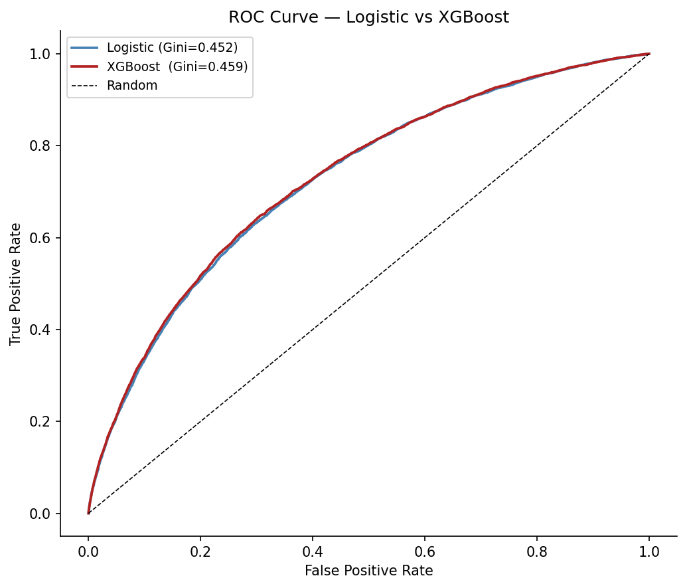
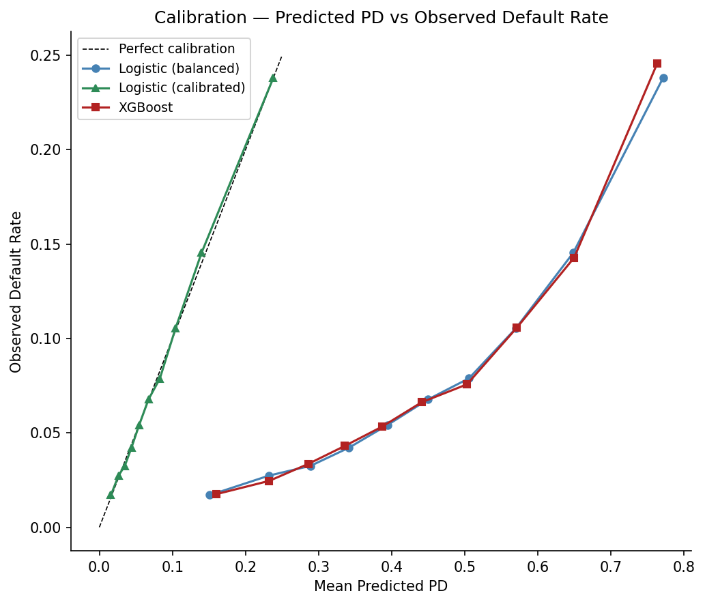
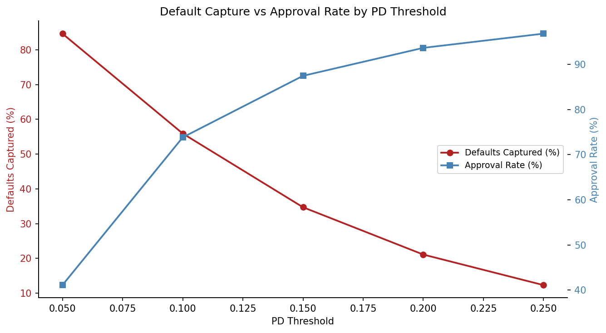

# Credit Scoring and PD Estimation

> **Track:** Resume B - Quantitative Risk & Analytics | **Environment:** Python 3.12 (`resume-b`) | **Status:** In progress

Estimate probability of default (PD) for retail loan applicants using a logistic regression scorecard with Weight of Evidence features, benchmarked against XGBoost.

---

## Objective

The output is a credit score in the style of Basel IRB internal ratings: interpretable, auditable, and calibrated to observed default rates for use in provisioning. Target use case: credit risk analyst at a bank, NBFC, or rating agency building or validating a retail PD model.

---

## Data Sources

| Dataset | Source | Period | Notes |
| :--- | :--- | :---: | :--- |
| Home Credit Default Risk | [kaggle.com](https://www.kaggle.com/c/home-credit-default-risk) | 2018 | 307,511 applications, 122 features, 8.1% default rate |

---

## Methodology

**Feature selection:** Seven candidate features covering income capacity (`AMT_INCOME_TOTAL`), debt burden (`AMT_CREDIT`), age (`DAYS_BIRTH`), employment stability (`DAYS_EMPLOYED`), and three external bureau scores (`EXT_SOURCE_1`, `EXT_SOURCE_2`, `EXT_SOURCE_3`). `AMT_INCOME_TOTAL` was dropped at IV 0.011 (below the 0.02 unpredictive threshold). Six features retained.

**WoE transformation:** Each feature binned using tree-based splits and transformed to Weight of Evidence values. Handles non-linearity and missing values without imputation. Missing value bins treated as a separate category with their own WoE.

**Logistic regression scorecard:** Fitted with `class_weight='balanced'` to compensate for the 8.1% default rate. Scorecard scaled to `points0=600`, `odds0=1/20`, `pdo=50`, the standard industry convention mapping scores to log-odds of non-default.

**XGBoost comparison:** `scale_pos_weight=11.39`, `n_estimators=100`, `max_depth=5`, `learning_rate=0.05`. Used as a performance ceiling benchmark.

**Calibration:** Balanced-weight logistic model produced mean absolute calibration error of 0.354, with predicted PDs 3 to 5 times above observed rates. Platt scaling (`CalibratedClassifierCV`, sigmoid, `cv=5`) corrected this to MAE 0.0018.

**Evaluation:** Gini ($2 \times \text{AUC} - 1$) and KS statistic as primary metrics. Accuracy not reported; majority-class baseline of 91.93% renders it uninformative.

---

## Results

| Model | Gini | KS | AUC |
| :--- | :---: | :---: | :---: |
| Logistic Regression | 45.2% | 33.4% | 72.6% |
| XGBoost | 45.9% | 34.2% | 72.9% |

Both models fall within the 40-60% Gini range typical for retail scorecards. XGBoost lift over logistic regression: 0.67pp, insufficient to justify sacrificing scorecard interpretability for regulatory purposes.

Calibration post-Platt scaling: MAE 0.0018 across 10 deciles.

Threshold analysis at 0.10 PD cutoff: 55.9% of defaults captured, 73.8% approval rate, 17.3% precision on flagged applicants.

---

## Limitations

Expand

- Feature set restricted to 7 variables from a 122-column dataset; bureau tradeline history, payment behaviour, and derived ratios (debt-to-income) would materially improve KS above the 40% adequacy threshold.
- `DAYS_BIRTH` survived IV filtering (0.081) but contributes zero scorecard points after conditioning on correlated predictors; a VIF check pre-fitting would identify and resolve this.
- WoE binning uses tree-based splits which can overfit bin boundaries on large samples; monotonicity constraints would be imposed in a production scorecard.
- Auxiliary tables (bureau, previous applications, instalments) from the Home Credit dataset not incorporated; these are standard inputs in a production PD model.
- Single dataset validation only; a production model requires out-of-time and out-of-sample validation on held-out vintages.

---

## References

- Home Credit Default Risk dataset: [kaggle.com](https://www.kaggle.com/c/home-credit-default-risk)
- scorecardpy documentation: [github.com/ShichenXie/scorecardpy](https://github.com/ShichenXie/scorecardpy)
- Basel II IRB approach, PD/LGD/EAD definitions: [PDF](https://www.bis.org/publ/bcbs128.pdf)
- Baesens et al., Credit Risk Analytics: [creditriskanalytics.net](http://www.creditriskanalytics.net/)
